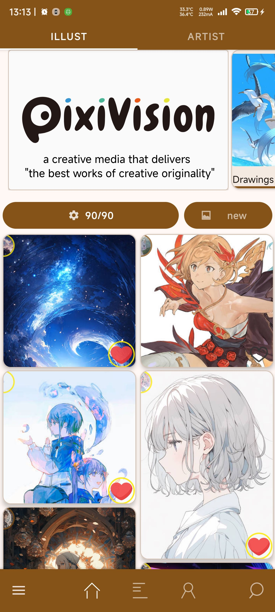
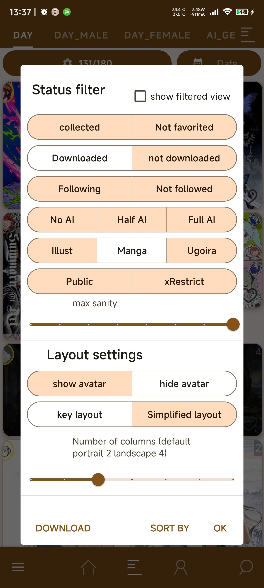
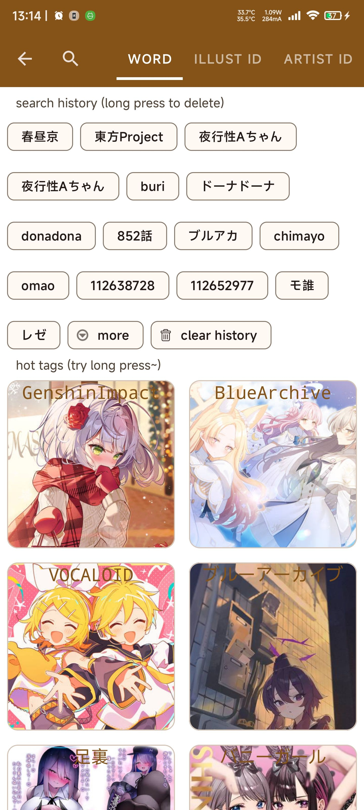
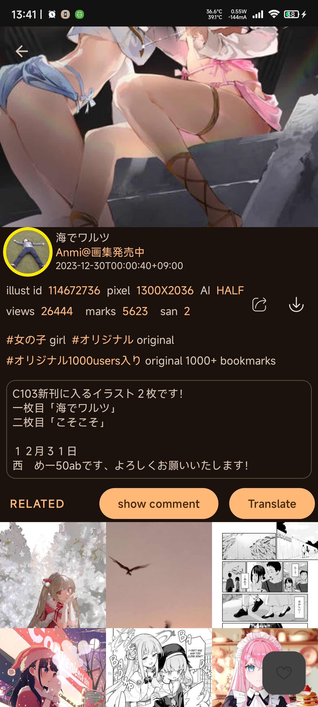
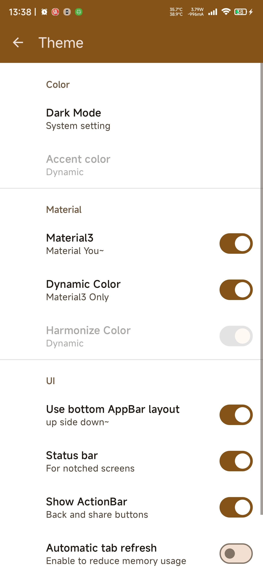
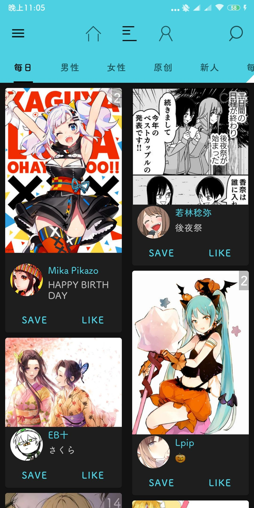
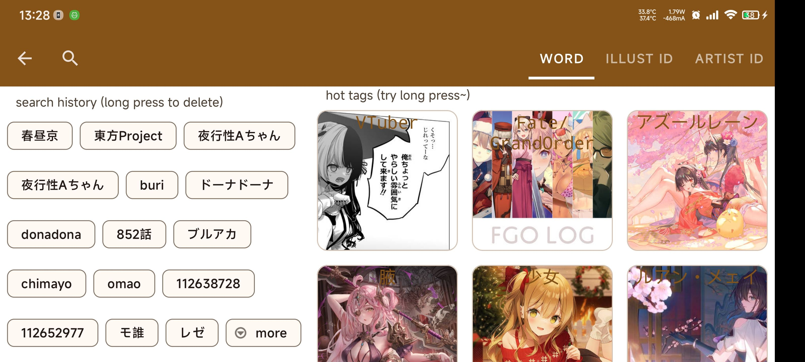
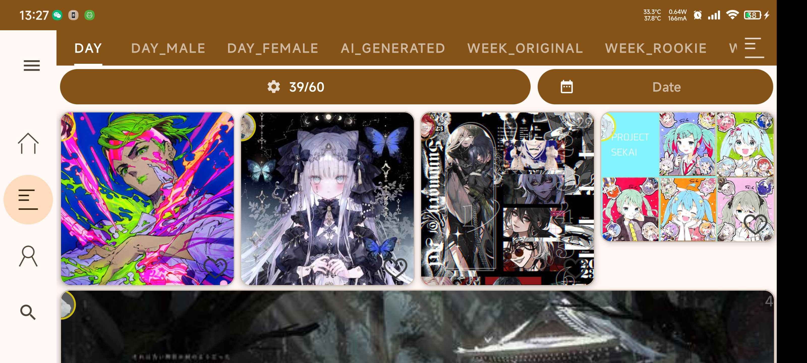

#  PixEz 阅读器 

一个支持免代理直连 + 多种额外特性功能优化的第三方 Pixiv android 客户端 。（Android 5.0+）
 >A third-party Pixiv Android client with modern design and many other enhancements. (Android 5.0+)
 

 

基于Kotlin+jetpack
维护的 [Pix-EzViewer](https://github.com/ultranity/Pix-EzViewer)，[点此查看更新记录及TODO](https://github.com/ultranity/Pix-EzViewer/blob/master/ReleaseNote.md)
,目前建议优先通过本repo提交issue进行反馈

## 1.功能特性

* Material 2/3切换，夜间模式，自定义主题
* 自定义UI，横/竖屏自适应，可切换顶部/底部导航栏
* 内容过滤(隐藏已收藏/已保存图片)，批量下载
* 历史记录，下载记录
* 一键收集模式（下载、收藏、关注三连）
* 多用户切换
* aria下载加速
* 通过`SSLSocket` 实现绕过 SNI 审查（旁路阻断）直连 Pixiv
* 多种自定义文件命名方式（保存tags等信息）
* 本地图片pid检测&批量重命名
* 增强搜索, 图片搜索（sauceNAO）
* GIF 播放、保存
* 谷歌翻译（需安装app）
* 查看\添加\回复评论
* Pixiv 特辑
* R80显示（需自行到官网开启），自动私密收藏，独立下载文件夹
* …… 更多特性请下载体验

如果你觉得这个应用还不错，[点此](https://github.com/Ultranity/Pix-EzViewer#支持) 支持一下吧！

# 下载

|                                     来源                                      |                            说明                            |
|:---------------------------------------------------------------------------:|:--------------------------------------------------------:|
|    [GitHub Release](https://github.com/ultranity/Pix-EzViewer/releases)     | 点这个，在 GitHub Release 页面下载完整 APK 适用于没有 Play / 分享给他人时 |
| [F-droid](https://f-droid.org/packages/com.perol.asdpl.play.pixivez.libre/) |             F-droid 分发，注意与Github release包名不同             |

Java 端通过修改 `OkHttp` 的 `SSLSocket` 实现绕过 SNI 审查（即旁路阻断）直连 Pixiv 的功能

- 具体实现 [点此](https://github.com/Notsfsssf/Pix-EzViewer/tree/master/app/src/main/java/com/perol/asdpl/pixivez/networks) 浏览

如果直连代码对你有所启发，在项目或者程序中注明 [Notsfsssf](https://github.com/Notsfsssf) 的 ID
的话，[Notsfsssf](https://github.com/Notsfsssf) 会很高兴的ヽ✿゜▽゜)ノ

***

如果你正在使用 Muzei 的话，那么由 [@Antony](https://github.com/yellowbluesky) 开发的 [Pixiv for Muzei 3](https://github.com/yellowbluesky/PixivforMuzei3) 是个不错的选择；

如果你需要一个 UWP 客户端，那么由 [@tobiichiamane](https://github.com/tobiichiamane) 开发的 [pixivfs-uwp ](https://github.com/tobiichiamane/pixivfs-uwp)会是不二之选；

如果你需要一个 WPF 客户端，那么可以尝试一下由 [@Rinacm](https://github.com/Rinacm) 开发的 [Pixeval](https://github.com/Rinacm/Pixeval) 。

# Preview

## 丰富功能

|  |  |  |  |
|:------------------------------:|:--------------------------------:|:--------------------------------:|:-------------------------------------:|

## UI自定义

|  |  |  |  |
|:-----------------------------------:|:-----------------------------------:|:---------------------------:|:-----------------------------------:|

## 横屏支持

|  |  |  |
|:--------------------------------:|:----------------------------------:|:---------------------------------:|

# 交流反馈

对于普通用户，**如果在使用过程中有任何疑问，请先参考我们的 [常见问题](/help/README.md) 页进行快速自查。**

如果你的问题不在上述页面范围内，你可以通过 Email (Pix-Ez@outlook.com) 或 [GitHub Issues](https://github.com/ultranity/Pix-EzViewer/issues) 或 下面的聊天群 提交反馈。

如果你是有能 man，且愿意为本项目贡献代码，请不要犹豫提交 Pull Request 吧！

此外，你可以进企鹅群交流经验或者反馈：815791942

也可以在 Telegram 群交流反馈：[@PixEzViewer](https://t.me/PixEz_Viewer)

## 支持

如果你觉得这个应用还不错，就支持一下吧！

|                                       国内                                       |                                                                                                        国外                                                                                                         |
|:------------------------------------------------------------------------------:|:-----------------------------------------------------------------------------------------------------------------------------------------------------------------------------------------------------------------:|
| [点此](https://github.com/ultranity/Pix-EzViewer/blob/master/donation/README.md) |  |

## Ref links:

- https://github.com/Notsfsssf/pixez-flutter
- https://github.com/upbit/pixivpy/wiki
- https://github.com/CeuiLiSA/Pixiv-Shaft
- https://github.com/git-xiaocao/pixiv-kotlin-api
- https://github.com/cssxsh/pixiv-client